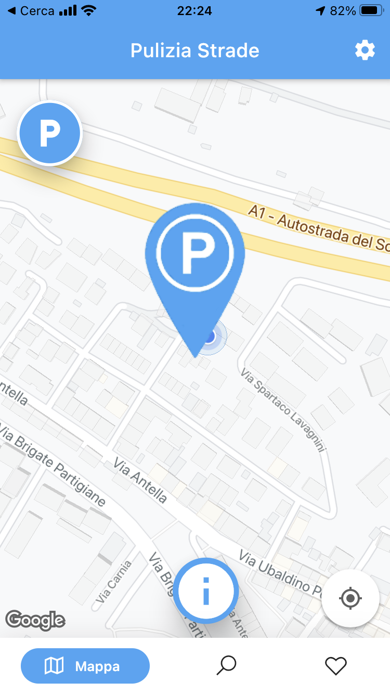
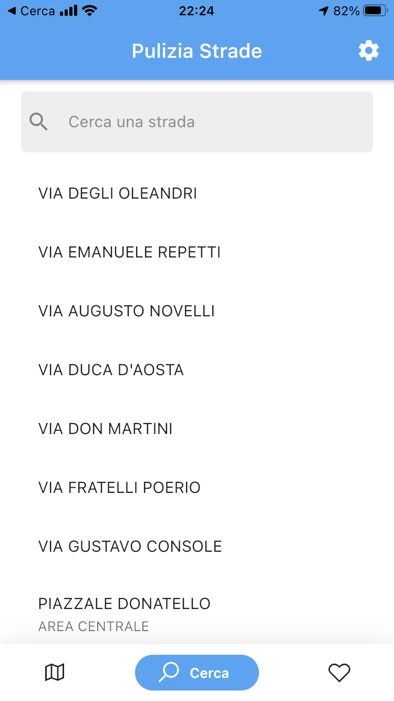
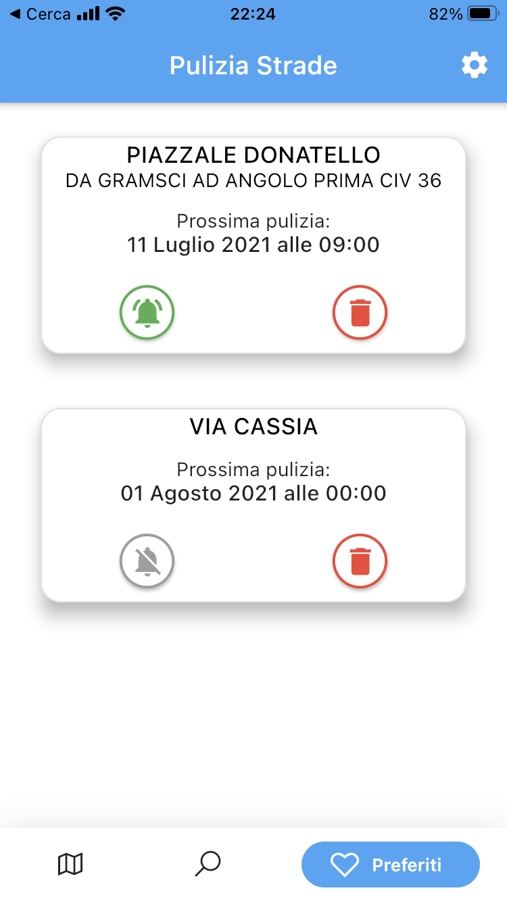

# Pulizia Strade Firenze

## Overview
- **Academic Year**: 2020-2021
- **Project Title**: App PuliziaStrade Firenze: implementation and usability testing of an application using the Flutter framework
- **CFUs**: 9

## App Pages

The app has three main pages:

Map page             |  Search page | Favourites page
:-------------------------:|:-------------------------:|:-------------------------:
  |  | 
